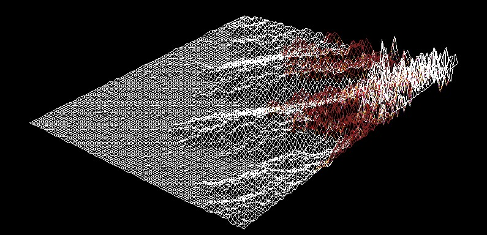
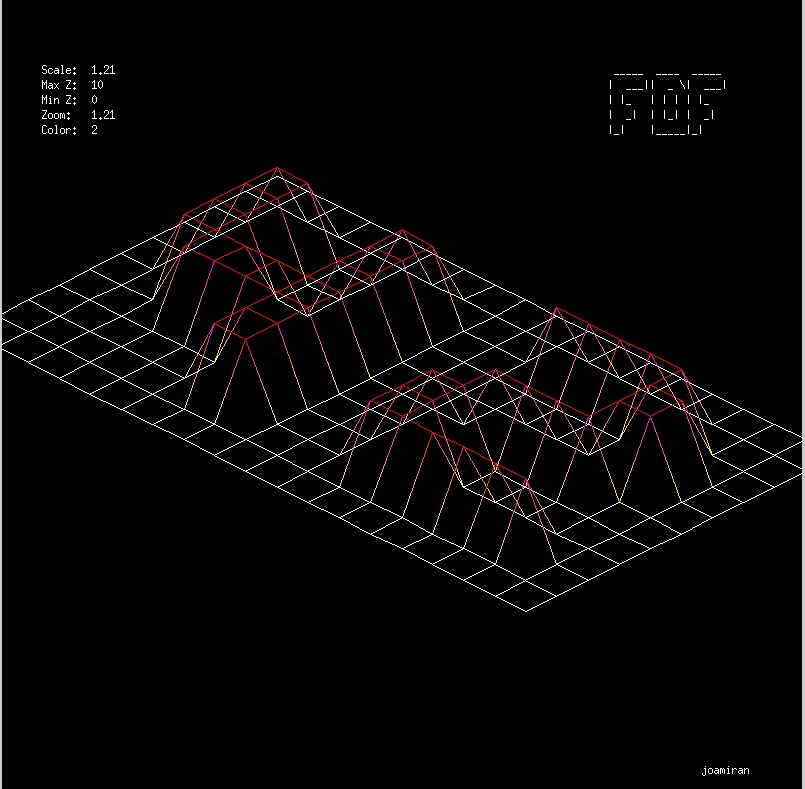

# FDF Project
### (42 School Project | still in progress)
---

---

## Overview

The FDF (Fil De Fer) project is a graphical program that reads a file containing 3D map data and visualizes it in a 2D window using isometric projection. The program uses the MiniLibX graphics library to render the map and display it in a window. This project is a part of the 42 School curriculum, designed to teach students about graphics programming, file parsing, and memory management.
---
---
## Features

- Reads 3D map data from a file in the form of coordinates.
- Visualizes the 3D map in a 2D isometric projection.
- Displays relevant info on the screen.
- Supports basic interaction via keyboard and window events.

## Getting Started

### Prerequisites

- MiniLibX library
- Make sure you have a Unix-like operating system (Linux or macOS).

### Installation

1. **Clone the repository:**

```sh
git clone https://github.com/jcmspg/fdf.git
cd fdf
```

2. **Build the project:**

```sh
make
```

### Running it

To run the program, use the following command:

```sh
./fdf <file>
```
### Fdf file format
The `fdf` program reads .fdf files, which are text files representing 3D maps. Each line in the file corresponds to a row of points in the grid, and each number represents the height of a point. Points can also have optional color values specified in hexadecimal format.

#### Example .fdf file
```
0  0  0  0  0
0  1  1  1  0
0  1  2  1  0
0  1  1  1  0
0  0  0  0  0
```
In this example, the grid is a 5x5 matrix where the numbers represent the height of each point. The center of the grid has higher values, creating a small hill.

#### Example with colors
```
0  0  0  0  0
0  1,0xFF0000  1,0x00FF00  1,0x0000FF  0
0  1,0xFFFF00  2,0xFF00FF  1,0x00FFFF  0
0  1,0xFFFFFF  1,0x000000  1,0x888888  0
0  0  0  0  0
```
In this example, each height value is followed by a comma ',' and a hexadecimal color code, specifying the color of that point.

#### Usage

To run the program with an .fdf file:
```
./fdf path/to/your/file.fdf
```
Or just use some of the provided maps, for example:
```
./fdf maps/test_maps/42.fdf
```
In the previous case, the program should produce something like this


You can also generate a random map using the map_generator.oy script located in the maps/ directory:

```sh
python3 maps/map_generator.py
```


this will create a file name `height_map.fdf` in your `maps/` folder that you can use with the fdf executable:

```sh
./fdf maps/height_map.fdf
```

Feel free to modify tge values in the scrip to generate different grid patterns. 


**there is some degree of interactivity, here are the controls you can press:**
 - WASD to pan the grid around
 - UP DOWN to zoom in and out
 - LEFT RIGHT to increase or decrease the height values
 - C to change colour scheme
 - R to reset view
 - ESC to close


Functions Used

    . *WIP*
    ___
    ___
    
    . read_fdf(file, grid): Reads the 3D map data from the file and stores it in the grid structure.
    . init_mlx(): Initializes the MiniLibX library.
    . create_window(window): Creates a window with the specified dimensions.
    . create_image(window): Creates an image buffer to draw on.
    . draw_line(window, p1, p2, color): Draws a line between points p1 and p2 with the specified color.
    . mlx_put_image_to_window(mlx, win, img, x, y): Displays the image in the window.
    . mlx_string_put(mlx, win, x, y, color, string): Displays a string in the window at the specified coordinates.
    . mlx_key_hook(win, key_handle, param): Sets up a key hook to handle keyboard events.
    . mlx_hook(win, 17, 0, close_window, param): Sets up a hook to handle window close events.
    . mlx_loop(mlx): Starts the MiniLibX event loop.

File Structure

    . src/: Contains the source code files.
    . inc/: Contains the header files.
    . maps/: Contains sample 3D map data files.
    . Makefile: Script to build the project.

Dependencies

    MiniLibX: A small graphics library for creating windows, drawing images, and handling events.


This project is licensed under the MIT License. See the LICENSE file for details.
Acknowledgments

Thanks to the authors and maintainers of MiniLibX.
Special thanks to the 42 School for providing the project specifications and environment.
